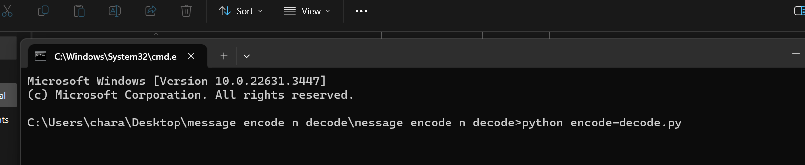
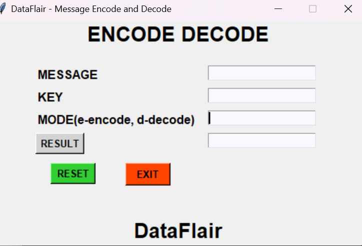
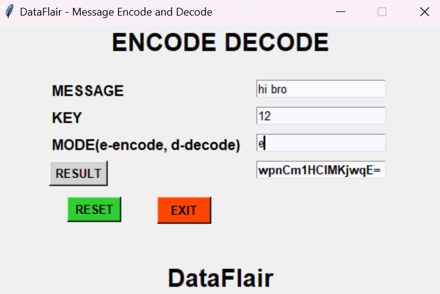
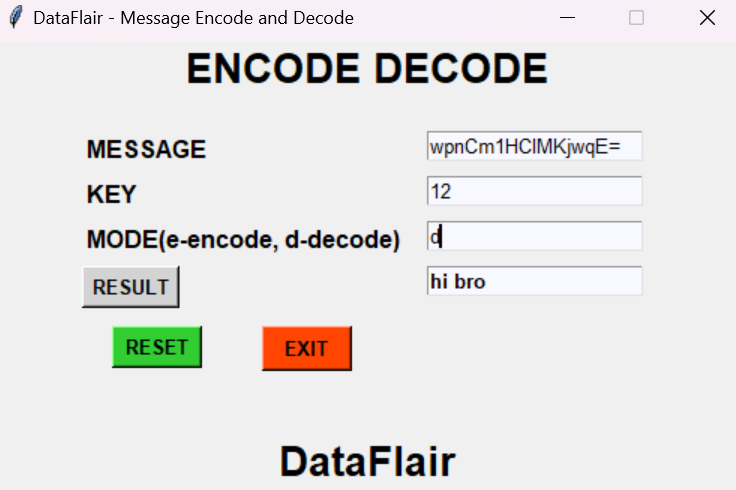
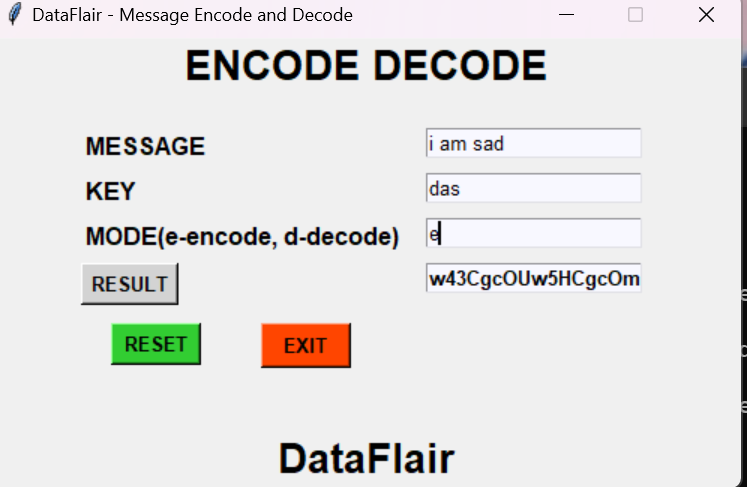
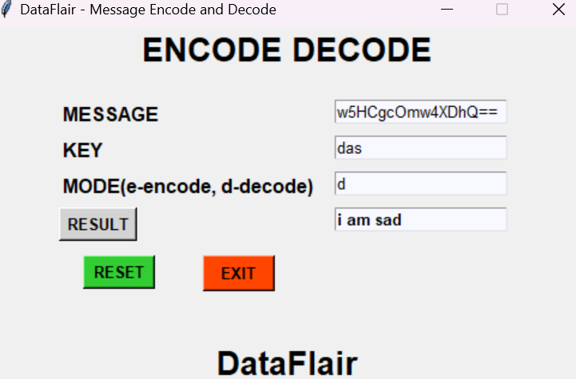

# Message-Encode-And-Decode

<h2>Objective:</h2>

In today’s world, data can easily be stolen and used by hackers. With data encryption and decryption, we can secure our messages. The project aim to develop a secure sensitive information by encoding messages. Message encoding and decoding is the process to first convert the original text to the random and meaningless text called ciphertext. This process is called encoding. Decoding is the process to convert that ciphertext to the original text. This process is also called the Encryption, Decryption process. This objective of this project is to encode and decode messages using a common key. This project will be built using the Tkinter and base64 library .In this project, users have to enter the message to encode or decode. Users have to select the mode to choose the encoding and decoding process. The same key must be used to process the encoding and decoding for the same message. Base64 is a library that allows the user to encode and decode the string. The string to be encoded should be in byte form. A function to encode binary information to ASCII characters then decode those ASCII classic characters to binary data is provided by the base64 module.

<h2>Additional Python Libraries Required :</h2>
<ul>
  <li>tkinter</li>
  
       pip install tkinter
</ul>
<ul>
 <li>base64</li>
  
       pip install base64
</ul>
<h2>Usage :</h2>
 <ul>
  <li>Download my Repository</li>
  <li>Open your Command Prompt or Terminal and change directory to the folder where all the files are present.</li>
  <li><b>Encoding And Decoding Messages</b> Use Command :</li>
  
      python encode-decode.py
</ul>
<ul>
  <li>Press Exit to stop the program execution.</li>
</ul>
<h2> Working:</h2>

type command:
    >python enocde-decode.py

   
    

   
The main Interface opens:
 
    

<h2> Examples:</h2>

 
encoding message 1:

    

decoding message 1:
 
    

encoding message 2
 
    

decoding message 2
 
    

